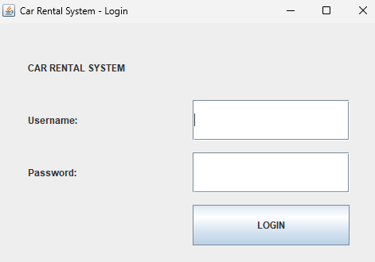
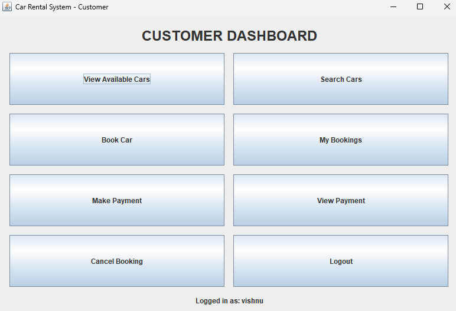
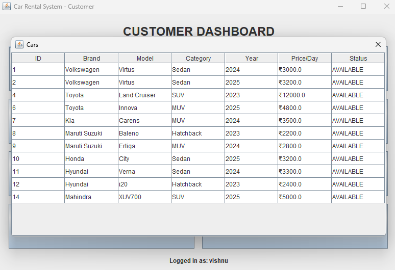
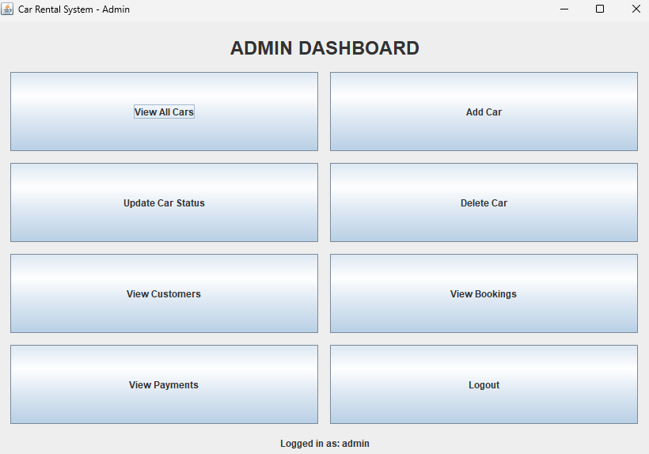

# Car Rental Management System

A Java-based desktop application for managing car rentals, developed using **Java Swing, JDBC, and Oracle Database**.

The system provides separate interfaces for **Customers and Administrators**, with features for car browsing, booking, payments, booking management, and administrative car management.

## Features

### Customer

* User login
* View available cars
* Search cars by brand
* Book a car
* Automatic rental amount calculation
* View booking history
* Make payments
* View payment details
* Cancel bookings

### Admin

* Admin login
* View all cars
* Add cars
* Update car status
* Delete cars
* View customers
* View bookings
* View payment information

## Technologies Used

* Java
* Java Swing
* JDBC
* Oracle Database
* SQL
* Object-Oriented Programming
* DAO Design Pattern

## System Architecture

```text
        Java Swing GUI
              ↓
        Model Classes
              ↓
          DAO Layer
              ↓
             JDBC
              ↓
      Oracle Database
```

## Database

The application uses Oracle Database to store:

* Users
* Customers
* Cars
* Brands
* Models
* Categories
* Bookings
* Payments

The database SQL script is provided in the `database` folder.

## Screenshots

### Login



### Customer Dashboard



### Available Cars



### Admin Dashboard



## How to Run

1. Install Java JDK.
2. Install Oracle Database.
3. Create the database using the SQL script in the `database` folder.
4. Configure Oracle credentials in `DBConnection.java`.
5. Add the Oracle JDBC driver.
6. Run `LoginFrame.java`.

## Project Structure

```text
src/
├── model/
├── dao/
├── gui/
├── util/
└── main/

database/
screenshots/
lib/
README.md
.gitignore
```

## Learning Outcomes

This project demonstrates practical implementation of:

* Object-Oriented Programming
* Java GUI development
* JDBC database connectivity
* SQL and relational database operations
* DAO architecture
* Role-based application access
* CRUD operations
* Database transactions
